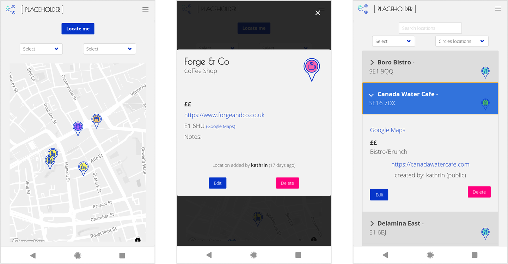

###  General Assembly, Software Engineering Immersive
# Placeholder

## Overview

This is the third project of the software engineering immersive course at GA London. The assignment was to create a **full-stack application** in **teams of 3** within **one week**.

Placeholder is a platform that allows users to save their favourite locations (e.g. restaurants, pubs or shops) for safe-keeping and to retrieve these easily on a map to find the ones nearby. It also allows users to add each other to their 'circle', and therefore displaying also locations from other users that they have decided to share with their friends.

You can launch the app on Heroku [here](https://ga-placeholder.herokuapp.com/), or find the GitHub repo [here](https://github.com/katheich/placeholder).

## Brief

* Work in a team, using **git to code collaboratively**.
* **Build a full-stack application** by making your own backend and your own front-end
* **Use an Express API** to serve your data from a Mongo database
* **Consume your API with a separate front-end** built with React
* **Be a complete product** which most likely means multiple relationships and CRUD functionality for at least a couple of models


## Technologies used
- HTML
- CSS
- JavaScript (ES6)
- React.js
- Express
- Mocha and Chai
- React Map GL (Mapbox)
- Postcode API
- Mongo and Mongoose
- React Toastify
- Moment
- Git and GitHub
- Bulma
- Google Fonts

## Approach

### Planning

- On the first day we came up with the idea of the app and the wireframes for all the pages.


- We also planned out the schemata and end points that we would need on the back-end.


### Back-end

**Schemata**

- For the MongoDB, we set up two schemata, one for locations that would be saved by the users and one for users.

- The location schema simply included the relevant pieces of information and was linked up to the user schema. Only the name, postcode, category and privacy setting are required and none of the fields are forced to be unique as several users could save the same location to the database.

  ```js
  const locationSchema = new mongoose.Schema({
    name: { type: String, required: true },
    postcode: { type: String, required: true },
    category: { type: String, required: true },
    website: { type: String },
    priciness: { type: Number, min: 1, max: 3 },
    openLate: { type: Boolean },
    privacy: { type: Number, min: 1, max: 3, required: true },
    notes: { type: String },
    user: { type: mongoose.Schema.ObjectId, ref: 'User', required: false }

    }, {
      timestamps: true
  })
  ```

- For the user schema, we first created a circle schema. This would keep track both of the requests sent and the users that have already been approved to the circle via the relevant user IDs.

  ```js
  const circleSchema = new mongoose.Schema({
  approved: [{ type: mongoose.Schema.ObjectId, ref: 'User' }],
  requested: [{ type: mongoose.Schema.ObjectId, ref: 'User' }]
  })

  const userSchema = new mongoose.Schema({ 
    username: { type: String, required: true, unique: true }, 
    password: { type: String, required: true  },
    circle: circleSchema
  }, {
    timestamps: true, 
    toJSON: { 
      transform(doc, json) {
        return { 
          username: json.username,
          id: json._id
        }
      }
    }
  })
  ```
- The user schema also includes a virtual field for the password confirmation which is checked before validating the data point and allowing it to be saved. It also hashes the password prior to storing it.

**API End-points**

1. User

  |           	| GET 	| POST 	| PUT 	| DELETE 	|
  |-----------	|-----	|------	|-----	|--------	|
  | /register 	|     	|   x  	|     	|        	|
  | /login    	|     	|   x  	|     	|        	|
  | /circle   	|  x  	|   x  	|  x  	|    x   	|

- `/register` only has a post route, where the user's data is received and stored in the database.
- Similarly, `/login` only has a post route, where the user's login information is received, checked and, if valid, a token is return and saved to localStorage.
- `/circle` is the most complex route, having all four possible options. 
  - The GET route returns a list of all the users who have requested to be added to the request maker's circle, as well as all currently approved users.
  - The POST route is used to request another user to be added to the request maker's circle, by using the other's username. The API then adds the request maker's ID to that user's 'Requested' list. 
  - The PUT route approves one of the users from the request maker's requests list, again by providing their username.
  - The DELETE route removes one of the users from the request maker's approved list and therefore from that user's circle, also by providing their username.

2. Location

  |                      	| GET 	| POST 	| PUT 	| DELETE 	|
  |----------------------	|-----	|------	|-----	|--------	|
  | /locations           	|  x  	|   x  	|     	|        	|
  | /locations/available 	|  x  	|      	|     	|        	|
  | /locations/:id       	|  x  	|      	|  x  	|    x   	|

- `/locations` has both a GET route, which was only used for development and provides all locations in the database, and a POST route, where users can post new locations to the database.
- `/locations/available` only has a GET route, which provides a complete list of all the locations that the request maker has access to (i.e. all locations of their own, those shared by their circle and all public locations).
- `/locations/:id` has the following routes for a single location identified by the ID: 
  - The GET route provides all information of that location.
  - The PUT route allows that information to be altered by new data provided, but only by the user who created the location.
  - The DELETE route allows the user who created the location to delete it as well.

**Tests**

- We wrote a few tests to ensure our Login, Register and Index routes were behaving as they should. This was especially critical for the last of these, as we could check with a only few examples that different users could only access the correct locations given the various privacy settings.

### Front-end

**Map**
- We used Uber's React Map GL package for Mapbox. 
- Using the `/locations/available` end point of our API, we request all the location data available to the user that is currently logged in and filter the information displayed only on the front-end.
- We use the Postcode API to receive latitudes and longitudes for the postcodes saved in our database.
- Rather than using the inbuilt functionality from Mapbox, which we understand does not work on mobile, the 'locate me' button uses the browser's in-built `navigator.geolocation.getCurrentPosition()` function. It triggers the appearance of a 'add my location' button which converts the current latitude/longitude information and pre-fills it in the 'add new location' form.

**New/Edit Location**
- The location form that underlies both the 'Add new location' and 'Edit location' pages validates the postcode entered by querying the Postcode API whenever the field is blurred. It only checks that the API returns a status 200, highlighting in green if it does and in red if not.
- The 'submit' button only becomes active if the bare minimum number of requirements are fulfilled, i.e. the required fields of the database schema are filled in (name, category, privacy and postcode) and the postcode has been validated.

**Circle**
- Since the API requires a target username in the request body for all of the POST, PUT and DELETE routes on `/circle`, the buttons for each user are given an id of with username, which can then be read off the event target and sent to the backend.

**Toastify**
- For the map, list and circle pages we implemented popups using Toastify that display the API responses.


### Complete final file structure

```
├── README.md
├── backend
│   ├── app.js
│   ├── config
│   │   └── environment.js
│   ├── controllers
│   │   ├── locations.js
│   │   └── users.js
│   ├── db
│   │   └── seeds.js
│   ├── dist
│   │   ├── bundle.js
│   │   └── index.html
│   ├── lib
│   │   ├── errorHandler.js
│   │   └── secureRoute.js
│   ├── models
│   │   ├── Location.js
│   │   └── User.js
│   ├── router.js
│   └── test
│       ├── helper.js
│       ├── locations
│       │   └── index_spec.js
│       └── users
│           ├── login_spec.js
│           └── register_spec.js
├── frontend
│   └── src
│       ├── app.js
│       ├── components
│       │   ├── Circle.js
│       │   ├── EditLocation.js
│       │   ├── Home.js
│       │   ├── List.js
│       │   ├── LocationForm.js
│       │   ├── LocationModal.js
│       │   ├── LoginForm.js
│       │   ├── LoginModal.js
│       │   ├── Map.js
│       │   ├── Navbar.js
│       │   ├── NewLocation.js
│       │   ├── RedirectHome.js
│       │   ├── RegisterForm.js
│       │   └── RegisterModal.js
│       ├── images
│       │   ├── locationicons
│       │   │   ├── brunch-colour.png
│       │   │   ├── coffee-colour.png
│       │   │   ├── other-colour.png
│       │   │   ├── pub-colour.png
│       │   │   ├── restaurant-colour.png
│       │   │   ├── shop-colour.png
│       │   └── logo.png
│       ├── index.html
│       ├── lib
│       │   ├── authMethods.js
│       │   └── privateRoutes.js
│       └── style.scss
├── nodemon.json
├── package-lock.json
├── package.json
└── webpack.config.js
```

## Screenshots





## Potential future features

- Being able to go from a location on the 'list' view to the map to see where it is
- More options on user management, e.g. changing passwords or deleting the user
- Comment feature on locations

## Bugs 

- 'locate me' button does not seem to work on iOS devices (but works fine on Android)

## Lessons learned

- In many cases one can decide whether to implement something on the front-end or back-end, or even both, for example:
  1. Initially we had implemented the filtering of locations by privacy on the back-end, but we realised that it was more straightforward to create one end-point for all the information the user has available and then filter the data displayed on the front-end instead.

  2. The location gets validated through the Mongoose schema (e.g. whether the requested fields are present), but the user will not be able to submit the form unless all these requirements are fulfilled, so should not never even be able to receive an error from that particular API end point.

- Seemingly innocuous decisions can cause a lot of trouble down the road. For example, we included a boolean in our Location Schema, but did not make it a required field. Since an empty string would be cast into a 'false' boolean, it was necessary to remove that entire field if it is empty before sending it to the API. Otherwise, lack of input would be saved as 'false'.

## Artwork and credit

[React Map GL](https://uber.github.io/react-map-gl/#/) by Uber

[Postcodes.io](https://postcodes.io/) maintained by IdealPostcodes

[React Toastify](https://github.com/fkhadra/react-toastify)

Logo made by [Icongeek26](https://www.flaticon.com/authors/icongeek26) from [www.flaticon.com](https://www.flaticon.com/)

Pub icon made by [Freepik](https://www.freepik.com/) from [www.flaticon.com](https://www.flaticon.com/), all others made by Kathrin Eichinger in same style

... and name provided by Michael Adair